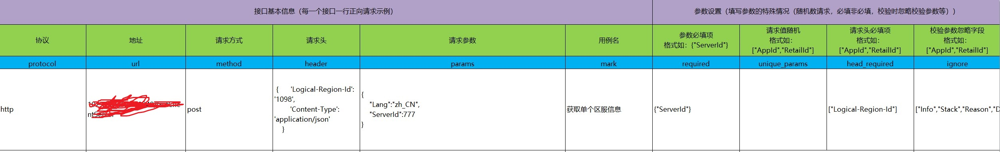
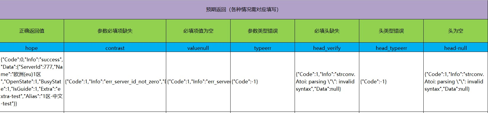
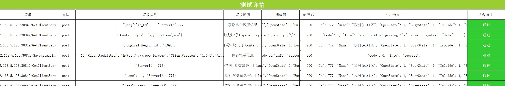

# 项目简介
基于python3的自动化接口测试，生成接口测试用例报告。

通过接口正向请求的示例生成各种异常情况的测试用例，并输出测试结果


## 代码结构

```
├─ Base            数据处理
│    ├─ BaseElementEnmu   文件路径配置
│    ├─ BaseExcel         生成的excel报告格式
│    ├─ BaseInit   
|    ├─ BaseRunner     
|    ├─ BaseStatistics            
|    ├─ BaseFile          文件操作
|    ├─ BaseGetExcel      读取请求的excel数据
|    ├─ BaseGetTestParams 生成测试用例（主要）
|    ├─ BaseParamsDispose 结果判断（主要）
|    ├─ BaseReq           请求（主要）
│  
├─Log           结果记录Log
│ 
├─Report           请求数据处理
│    ├─ api.xlsx         请求的文件
│    ├─ Report.xlsx       生成的报告
│ 
├─TestCases     测试用例入口  
│       
├─Runner           测试入口
│    ├─ runner        测试入口main
│    ├─ start_test.bat     一键运行bat脚本
│


```

## 使用说明

1，填写Report/api.xlsx 文件，每个接口填写一条正向请求数据：请求基本信息，参数设置（必填非必填，随机值请求，校验忽略项等），预期返回结果

2，运行代码runner.py 或者运行start_test.bat，在Report文件夹下生成对应的接口测试报告Report.xlsx

请求示例：




生成报告示例：



